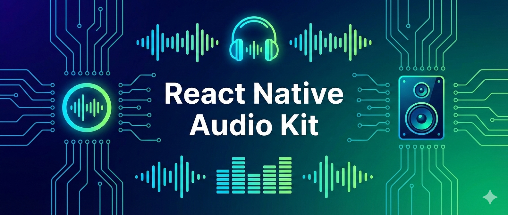

# React Native Audio Kit 🎵



A powerful, robust, and feature-rich audio library for React Native. Built with **ExoPlayer (Media3)** on Android and **AVPlayer** on iOS.

[](https://www.npmjs.com/package/react-native-audio-kit)
[](https://files.reactnative.dev)
[](LICENSE)

## Features

- 🔒 **Background Mode**: Keep playing when app is backgrounded or screen locked
- 🎧 **Controls**: Play, Pause, Seek, Volume, Rate, Loop
- 🪝 **React Hooks**: `useAudioPlayer` for easy integration
- 📱 **Lock Screen**: Notification controls and artwork

> 📘 **Full Documentation**: Check out the [User Guide & API Reference](USER_GUIDE.md) for detailed instructions on every function.

## Installation

```bash
npm install react-native-audio-kit
# or
yarn add react-native-audio-kit
```

## Setup

### iOS

1. Open `Info.plist`.
2. Add `UIBackgroundModes` key with value `audio`.
3. Add `NSMicrophoneUsageDescription` if using recorder.
4. Add `NSAppleMusicUsageDescription` if you want to access the Apple Music library via `getAllAudios`.

### Android

1. Open `AndroidManifest.xml`.
2. For audio retrieval, ensure you have requested permissions at runtime:
   - Android 13+: `READ_MEDIA_AUDIO`
   - Android < 13: `READ_EXTERNAL_STORAGE`
3. Foreground Service (`FOREGROUND_SERVICE_MEDIA_PLAYBACK`) is handled by the library, but ensure your app does not restrict background activity.

## Usage

### 🎵 Media Library & Queue (New!)

Manage a playlist### Media Library Helper
Fetch all local audio files.

```typescript
import { getAllAudios, getAlbums } from "react-native-audio-kit";

const songs = await getAllAudios();
console.log(songs[0]); // { title: "Song 1", artist: "Artist", uri: "..." }

// 2. Play Queue
const queue = new AudioQueue();
queue.playList(songs, 0); // Start playing first song

// Search example
const searchResults = await searchAudios("Love");
console.log("Found:", searchResults.length);

// 3. Control
queue.next();
queue.prev();

// 4. Subscribe to updates (Current Song, List)
queue.onChange((list, current) => {
  console.log("Now Playing:", current?.title);
});
```

_The **AudioQueue** automatically handles background playback and System Media Notifications (Lock Screen)._

### Playing Audio (Hook)

```typescript
import { View, Text, Button } from "react-native";
import { useAudioPlayer, PlaybackState } from "react-native-audio-kit";

const PlayerScreen = () => {
  const { player, state, position, duration, play, pause, seek } =
    useAudioPlayer("https://example.com/song.mp3", {
      autoDestroy: true,
      loop: false,
    });

  return (
    <View>
      <Text>Status: {state}</Text>
      <Text>
        Time: {position.toFixed(1)} / {duration.toFixed(1)}
      </Text>
      <Button title="Play" onPress={play} />
      <Button title="Pause" onPress={pause} />
      <Slider
        value={position}
        maximumValue={duration}
        onSlidingComplete={(val) => seek(val)}
      />
    </View>
  );
};
```

### Manual Player & Notifications

If you are not using `AudioQueue`, you can manage notifications manually:

```typescript
import { AudioPlayer } from "react-native-audio-kit";

const player = new AudioPlayer("file:///sdcard/music.mp3");

await player.prepare();
await player.setupNotification({
  title: "My Song",
  artist: "My Artist",
  artwork: "https://example.com/art.jpg",
  hasNext: true,
  hasPrevious: false,
});

player.play();
```

### Recording Audio

### `AudioRecorder`

Record audio from the microphone.

```typescript
import { AudioRecorder } from "react-native-audio-kit";

const recorder = new AudioRecorder();

// Start
const path = await recorder.prepare("file:///path/to/rec.aac", {
  sampleRate: 44100,
  channels: 1,
});
await recorder.start();

recorder.onMetering((db) => console.log("Level:", db));

// Stop
const resultPath = await recorder.stop();
```

## API

### `AudioQueue`

- `playList(songs, index)`: Replace queue and start playing.
- `add(songs)`: Add to end of queue.
- `next()` / `prev()`: Skip tracks.
- `onChange(callback)`: Listen for track changes.

### `AudioPlayer`

- `prepare()`: Async
- `play()`: Async
- `pause()`: Async
- `stop()`: Async
- `seek(position)`: Async
- `setVolume(0-1)`: Async
- `setRate(0.5-2.0)`: Async
- `setupNotification(config)`: Configure Lock Screen.
- `destroy()`: Cleanup

### `Media Helpers`

- `getAllAudios()`: Returns `Promise<AudioAsset[]>` (Device Scan).
- `getAlbums()`: Returns `Promise<Album[]>` (Grouped).
- `searchAudios(query)`: Returns `Promise<AudioAsset[]>` (Search by title/artist).

## License

MIT
